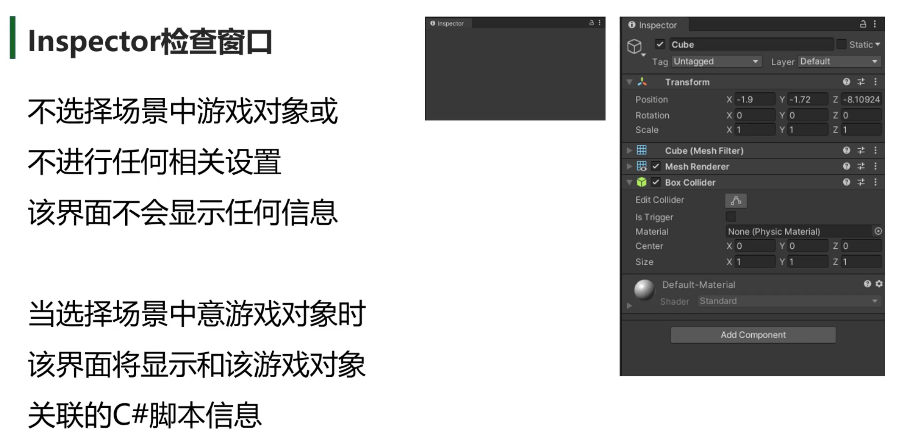

# Unity 笔记-001

## 项目组成——工程文件夹

- **Assets**：工程资源文件夹（美术资源，脚本等）

- **Library**：库文件夹（Unity自动生成管理）

- **Logs**：日志文件夹（Unity自动生成管理）

- **obj**：编译产生中间文件（Unity自动生成管理）

- **Packages**：包配置信息（Unity自动生成管理）

- **ProjectSettings**：工程设置信息（Unity自动生成管理）

## 引擎窗口

### Scene

### Game

### Project

### Inspector

### Console

### Toolbar

